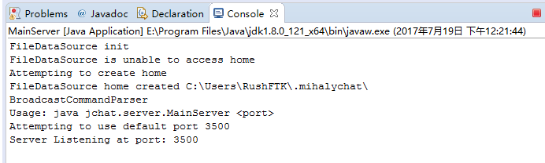
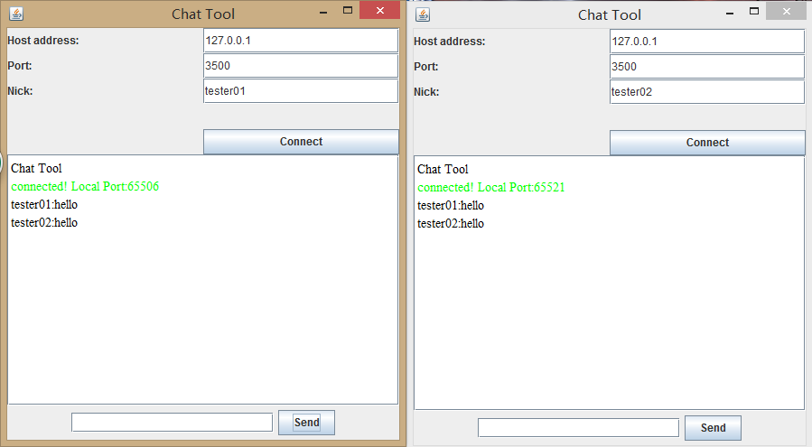
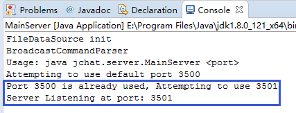
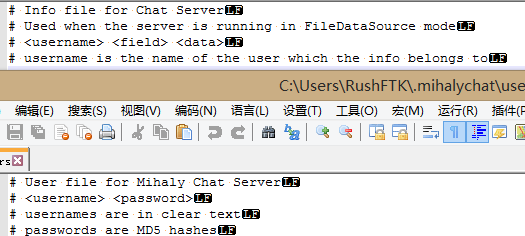
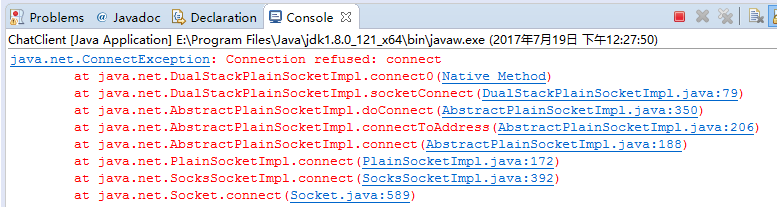
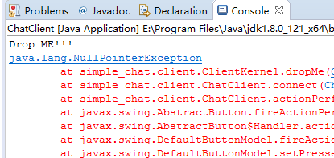
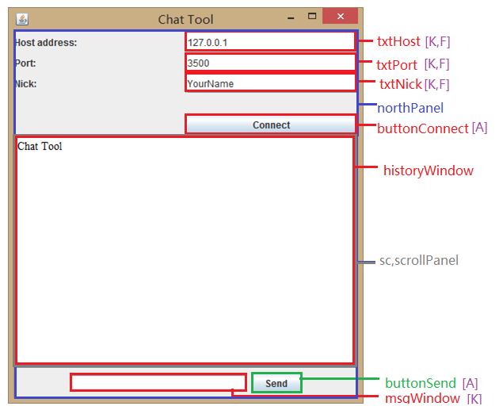

[返回首页](https://rushftk.github.io/SLT_ToolsKit/index_chs)  
_最后更新日期，2017-07-19_  
# show_simple_chat  
这里将说明教师给予的**实验三示例程序**的运行情况及结构说明  
## Menu
1. [运行时](#runtime)  
2. [结构分析](#analyze)  

## Runtime  
下面将说明运行时程序的各种表现。  
### 成功运行时  
  
运行Server目录下的`MainServer.java`，其为控制台应用程序，运行成功如上图所示。可以看到被设置的默认工作路径以及运行的端口。**除非终止程序，否则服务器端将一直进行运行。**  
  
运行Client目录下的`ChatClient.java`，其为JPanel生成的图形界面程序，在服务器已经运行的情况下，输入合法的Nickname，运行成功如上图所示。可以看到，在一个客户端上使用下面的对话框与send发送消息，存在回显，另一个客户端也可以看到  

### 错误  
  
如果在默认的3500端口被占用的情况下运行服务器端(例如：运行一个服务器后再运行`MainServer.java`)，那么程序将**自动**使用下一个端口。  
  
可以看到，服务器没有任何的日志记录。(甚至包括用户的登入，登出等)，可以通过users文件看到，应当允许用户设置登录的用户名和密码(但这个功能没有被使用)。  
  
如果客户端输入的port是一个没有开服务器的端口，那么客户端gui将**没有任何反应**。后台抛出异常提示拒绝连接，之后输出"Drop Me!!"  
  
同样的，客户端设置不正确时，gui同样没有任何反应，后台输出"Drop Me!!"。  

### 启示  
因此，通过运行时的程序表现，程序的缺陷如下：  
1.  补充：增加一个窗口，用户必须通过注册账号，并使用用户名和密码进入聊天界面，防止仿冒登录。  
2.  修正：当进行不正确的输入时，客户端的gui应当进行提示。  
3.  修正：对客户端的登录行为甚至聊天信息，服务器存在日志等信息记录。(可选加密)  
4.  界面友好性：增加帮助按钮，简要介绍用户程序使用方法。  
5.  界面友好性：服务器端异步的支持输入指令，或者增加gui模式。  

~~对于2，一个可能的方案是：客户端gui增加一个`Label`，当出现异常时：`label.text = exception.message`~~   
上面的方法经过测试后发现，虽然Traceback会报告存在对应的Exception(例如connect refused)，但是如果直接输出Exception.message仅会输出'NullPointerExcepiton'。原因正在研究中。  

[返回顶部](#show_simple_chat)  

## Analyze  
下面对示例程序的结构进行分析。在下面就将对  
### Client  
由于其是图形界面，因此包含[对界面元素分析](#client_ui)和[对客户端核心方法的分析](#client_menthod)
#### client_ui  
客户端采用了JPanel组织的图形界面，在下图中将展示该界面，并显示各控件的名称  
  
其中，每个控件名称后紫色方括号内的文字代表了他包含的匿名监听器的类型。存在匿名监听器的控件，可以通过调用方法，得知监听器所对应的事件是在哪个控件上发生的  
**A**代表含有`ActionListener`，即事件监听器，捕捉执行控件的时候的事件(例如按下按钮)。  
**K**代表`KeyListener`，即键盘监听器，捕捉键盘输入。  
**F**代表`FocusListener`，即焦点监听器，捕捉控件是否在焦点状态(比如鼠标指向或者键盘输入符在这个控件中)。  
`Event.getSource()`能够返回发生Event的控件。例如，当将鼠标指针指向txtNick上时，`FocusEvent.getSource()`返回`txtNick`  
对于控件的操作，`ClientKernel.java`中已经封装了部分方法进行控制，例如使用`getMsg(String)`就可以将信息打在historyWindows上。  
此外，一些对UI控制的方法并**没有**被使用，比如clear()方法，这也是一个扩展的机会。  
#### client_menthod  
源程序中很多方法结构简单，注释中已经说明，在下面，将对注释中标有**核心方法**字样的方法进行说明。  

[返回分析头部](#analyze)，[返回顶部][Go_Back_Top]

[Go_Back_Top]:#show_simple_chat
