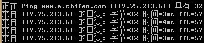

[返回首页](https://rushftk.github.io/SLT_ToolsKit/index_chs)  
_最后更新日期，2017-07-23_  
# show_simple_ping  
这里将说明教师给予的**实验二示例程序**的运行情况及结构说明  
## Menu  
1. [运行时](#runtime)  
2. [结构分析](#analyze)  
3. [额外信息](#extends_information)  

## Runtime  
下面将说明运行时程序的各种表现。  
### 成功运行时  
  
假设编译完成后的文件为`ping`，在**拥有管理员权限时**输入`./ping 127.0.0.1`可以成功ping本机。表现为无限的根据一定间隔发送seq请求。  
  
同样地，ping一个网页也是能够正常运行的。  
关于ping返回信息的具体含义，可参见额外信息中的[相关描述](#ping_returninfs)  

### 错误

[返回顶部][Go_Back_Top]  

## Analyze  
下面对示例程序的结构进行分析。  

[返回顶部][Go_Back_Top]  

## Extends_Information  
对于原指导书或自己被坑埋过地方的额外解释，以及相关性不大的内容  

### Ping_ReturnINFs  
  
成功后返回的结果，第一行描述了原始地址与解析后的IP地址，及发送包的大小  
第二行中的**seq**是接收到发送的包的序列号(结构体`icmp.seq`，TCP协议32~61位，Echo报文48~63位)，有时会在环路中接受到多次同一个包，那时候seq是相同的。  
其次，**ttl**指剩余转发次数(结构体`ip.ttl`，ICMP IP头64~71位)，如果ttl=0仍没有到目标服务器，则会链接超时。可以看到，到本机没有经过任何服务器，所以ttl保持64不变，至baidu经过了若干服务器的解析，因此变为了56。  
  
实际上，TTL说明上面的ping图是在**虚拟机内**的截图，在我原本的操作系统中ping时，ttl就会是57(如上图所示)。因为从本机至虚拟机增加了一次转发。  

### 扩展内容  
1.如果有兴趣了解关于为何`ping`百度网址却显示`www.a.shifen.com`，可参考此[**外部**链接](http://zhan.renren.com/starshen?gid=3602888498023142484&checked=true)  

[返回顶部][Go_Back_Top]  

[Go_Back_Top]:#show_simple_ping