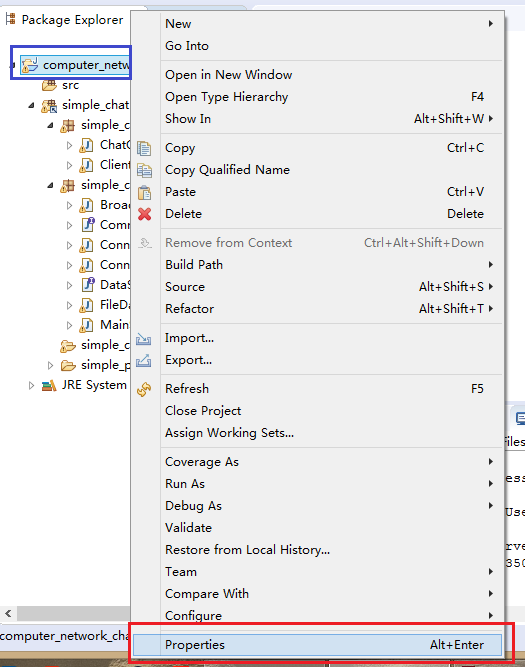
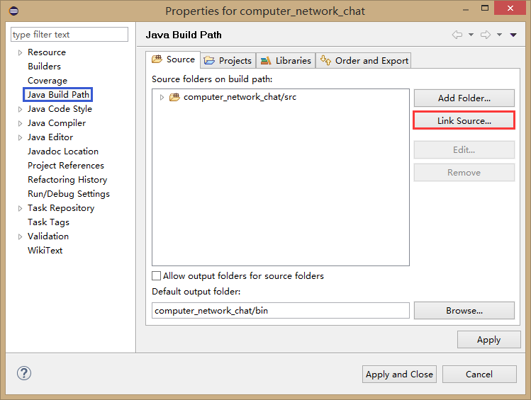
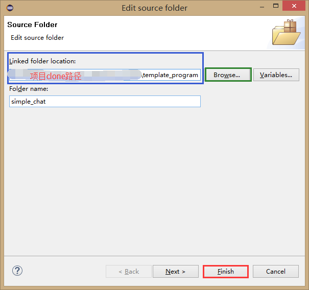

[返回首页](https://rushftk.github.io/SLT_ToolsKit/index_chs)  
_最后更新日期，2017-07-19_  
# How_To_Deploy  
了解与在本地部署项目的快速指南，for English tutorial,see also [here](https://rushftk.github.io/SLT_ToolsKit/tutorial_deploy).  
## Menu  
1.[目录](#menu)  
2.[快速开始](#quick_start)  
3.[附加说明](#additional_information)  

## Quick_Start  
### 配置开发环境  
现在处于理解代码阶段，还**未**决定使用的开发环境。  
实验二预计使用gcc编译器，在Linux下进行编译运行。(可以使用"计算机系统结构课设"中提供的gaomx虚拟机。)  
实验三预计使用Microsoft Visual Studio 2017。(或者使用Eclipse也有可能)  
(实验三可能会使用Python或C#重新进行工程构建。具体看情况商议而定，如果要使用Python，推荐使用JetBrain的PyCharm。)  
### 下载项目  
使用Git管理工具clone项目到本地。  
Windows、MacOS下推荐使用的Git管理工具为[SourceTree](https://www.sourcetreeapp.com/)，如果需要项目的修改权限，请_使用Github账号注册的邮箱_邮件至867871766@qq.com，我会给予权限。  
Linux下直接使用Terimal版本的git即可。  
本项目的git网址为：https://github.com/RushFTK/SLT_ToolsKit.git  
### 连接文件至本地的开发环境  
在本地环境新建Project。如果可能，请不要在clone的目录下新建Project，而是选择在其他目录下新建Project后，将源代码文件链接过去。因为这样做能保证该项目文件夹尽可能的干净，没有编译、连接等文件。  
如果为了本地磁盘管理方便而需要在clone的目录下新建Project，请将项目文件加入到.gitignore中，使其不参与版本管理从而不进行上传。  

### 关键文件说明  
**template_program/simple_ping** 实验二示例程序文件集  
**template_program/simple_chat** 实验三示例程序文件集  
**task2/ 实验二实验文件目录**  
**task3/ 实验三实验文件目录**  
### 规约说明  
1. (除非在初期)，推荐在进行某个部分更新时，单独开个分支(branch)，最后大家审核完后合并到主分支上(merge to master)。以免冲突。  
2. 尽可能的令程序调用接口，没有实现的接口可以直接抛出未实现异常。  

## Additional_Information
### 在Eclipse下，将其他文件夹的文件连接到当前项目中  
  
右击`Package Explorer`的项目文件夹(蓝色)，在弹出的菜单中选择`Properties`(属性，红色)。  
  
在弹出的窗口中，选择左侧导航栏中的`Java Build Path`(蓝色)，在右侧选择`Link Source...`(红色)。 
  
在弹出的窗口中，在`Linked folder location:`处填入`(自己clone的路径)\template_program`(蓝色)，或点击`Browse..`(绿色)在资源管理器中指定对应目录，由于该文件夹下没有其他干扰的java文件，因此点击`Finish`(红色)。  
回到第二步的界面，确认设置无误后，点击`Apply and Close`。  
### 常用git指令

### SourceTree的安装与使用  

### 指导书上关于gcc编译的使用摘要  
